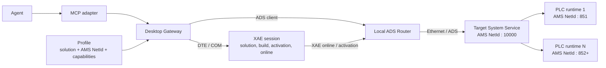

# Целевая архитектура TwinCAT Agent Gateway

> **Статус:** утверждённый несовместимый целевой контракт от 2026-07-31.
> Реализация намеренно может не соответствовать этому документу во время
> переработки. Реализованный до начала переработки baseline сохранён в
> [`ARCHITECTURE_V1_BASELINE.md`](ARCHITECTURE_V1_BASELINE.md).
> Последовательность перехода определяет
> [`ARCHITECTURE_REWORK_PLAN.md`](ARCHITECTURE_REWORK_PLAN.md).

## 1. Назначение

TwinCAT Agent Gateway — локальное Windows-приложение, которое предоставляет
агенту компактный, типизированный и наблюдаемый интерфейс к TwinCAT 3 XAE и к
разрешённым удалённым TwinCAT targets.

Gateway не скрывает предметные объекты TwinCAT за одним универсальным
«состоянием шлюза». Публичный контракт различает:

- Gateway process;
- XAE session;
- профиль проекта;
- выбранный в XAE TwinCAT system;
- удалённый Target System Service;
- отдельные PLC runtimes на target;
- operation и связанные с ней artifacts.

PLC source остаётся обычными файлами. Агент редактирует их стандартными
file/patch-инструментами, а Gateway отвечает за согласование XAE project model
с диском, сборку, активацию, runtime transitions, диагностику и результаты
тестов.

Целевая среда первого этапа переработки:

- TwinCAT 3.1.4024.17;
- Visual Studio 2019 или совместимый XAE Shell;
- Windows 10/11;
- .NET Framework 4.8 x86 для desktop/COM host;
- .NET 8 для MCP adapter;
- один интерактивный Windows user/session/integrity context для Gateway и XAE.

## 2. Основные принципы

### 2.1 Профиль является границей полномочий

Project profile одновременно:

- идентифицирует solution;
- идентифицирует target через AMS NetId;
- задаёт максимальный набор разрешённых действий;
- содержит параметры синхронизации, мониторинга и verification.

Если возможность включена в profile, дополнительное agent-side подтверждение
той же возможности не требуется. Gateway самостоятельно проверяет capability,
фактический XAE solution, target identity и текущие operator locks.

Явный запрет пользователя в текущем диалоге уменьшает полномочия сессии.
Агент никогда не использует другой путь автоматизации для обхода отказа
Gateway.

### 2.2 Агент передаёт profile, а не повторяет identity

Обычная операция принимает имя profile. Агенту не требуется передавать путь к
`.sln`, AMS NetId, ADS port или повторно запрашивать общий status перед каждой
операцией.

Gateway обязан непосредственно перед side effect:

1. разрешить profile;
2. проверить exact normalized `Solution.FullName` для XAE operation;
3. проверить target, выбранный в XAE, для XAE operation, затрагивающей target;
4. разрешить профильный AMS NetId для direct ADS observation;
5. проверить configured capability и session lock;
6. вернуть типизированное несоответствие с `expected` и `observed`.

Compact success не повторяет solution path и AMS NetId без необходимости.
Подробная identity доступна в object-specific resources и error details.

### 2.3 Публичные операции отражают объекты TwinCAT

Gateway сохраняет нативные понятия XAE, Target System и PLC runtime. Он не
должен вводить policy-команды вроде `recover_to_config`, когда TwinCAT уже
имеет обычную операцию перехода в Config.

Это не означает публикацию raw COM invoke или caller-selected ADS request.
Gateway по-прежнему отвечает за:

- один STA thread и COM serialization;
- XAE selection;
- dialogs;
- cancellation/deadlines;
- postconditions;
- audit trail;
- bounded structured results.

### 2.4 Tools выполняют действия, resources описывают состояние

- MCP tools используются для lifecycle и изменяющих операций.
- MCP resources возвращают state, diagnostics, capabilities, source manifest,
  documentation и immutable operation artifacts.
- Mutating tool всегда возвращает exact `operationId`.
- Относительные ссылки `last`, `previous` и `-N` не являются публичной
  identity операции.

### 2.5 Breaking rework без compatibility layer

Совместимость с именами tools, resources, IPC DTO и schema v1 не требуется.
Старые контракты удаляются, а не поддерживаются параллельно с новыми.
Переходная сборка может быть нерабочей между этапами, но каждый этап обязан
оставлять точный handoff и не маскировать отсутствующую реализацию.

## 3. Объектная модель и каналы взаимодействия



Есть два разных data/control path:

1. **Engineering path:** Agent → Gateway → DTE/COM → XAE → target.
   Используется для solution lifecycle, synchronization, build, activation и
   будущего XAE debugger.
2. **Direct ADS path:** Agent → Gateway → ADS Router → Ethernet/ADS → выбранный
   ADS server на target. Используется для state observations, TcUnit
   completion и будущих PLC read/write/debug primitives.

Прямое чтение PLC runtime не проходит через XAE. Поэтому проблемы XAE и ADS
route диагностируются отдельно.

## 4. Разделение состояний

Термин `runtime state` без указания объекта запрещён в публичных DTO и
документации: он неоднозначен.

### 4.1 Gateway state

Состояние desktop process и его внутренних сервисов:

```text
starting | ready | busy | faulted | stopping | unavailable
```

Оно ничего не говорит о XAE, remote target или PLC application.

### 4.2 XAE session state

Состояние engineering session:

- process identity и ownership;
- ROT/DTE availability;
- exact loaded solution;
- solution load state;
- selected solution configuration/platform;
- active project variant, если XAE его сообщает;
- synchronization state;
- dirty documents;
- текущая COM operation;
- XAE dialogs/errors.

Project variant на первом этапе только наблюдается. Gateway не выбирает и не
переключает его.

### 4.3 XAE-observed TwinCAT system state

XAE показывает состояние TwinCAT system для текущего engineering context.
Gateway хранит это как отдельное наблюдение:

```text
XaeTwinCatSystemObservation
```

Минимальные поля:

```json
{
  "source": "xae",
  "state": "run",
  "rawState": "Run",
  "selectedTarget": "profile-relative identity",
  "observedAtUtc": "2026-07-31T00:00:00Z",
  "freshness": "fresh"
}
```

Это может быть наблюдением того же физического target, который Gateway читает
через ADS, но оно имеет другой источник, lifecycle и freshness. Gateway не
подменяет отсутствующее XAE-наблюдение direct ADS state.

### 4.4 Состояние удалённого Target System

Authoritative direct observation выполняется на адрес:

```text
<profile AMS NetId>:10000
```

Port 10000 — TwinCAT System Service. DTO:

```text
TargetSystemObservation
```

Он хранит:

- profile;
- AMS NetId;
- port `10000`;
- raw `AdsState`;
- raw `DeviceState`;
- device-specific normalized state;
- ADS error/connection state;
- observation timestamp.

Normalized state:

```text
config | run | stop | exception | transitioning | unknown
```

Raw `AdsState` и `DeviceState` являются обязательной диагностической
информацией. `DeviceState` интерпретируется только в контексте System Service.

### 4.5 Состояния PLC runtimes

Каждый PLC runtime является отдельным ADS device на том же AMS NetId и
собственном ADS port, обычно `851`, `852` и далее.

DTO:

```text
PlcRuntimeObservation
```

Минимальные поля:

- logical runtime id;
- project/instance association, если подтверждена;
- AMS NetId;
- ADS port;
- raw `AdsState`;
- raw `DeviceState`;
- normalized PLC state;
- observation timestamp;
- read error.

Normalized PLC state:

```text
run | stop | reset | exception | transitioning | unknown
```

Одинаковое числовое значение `AdsState` может иметь device-specific смысл.
Gateway не применяет одну агрегирующую таблицу ко всем ADS ports без
проверенного mapping.

### 4.6 Запрет aggregate runtime mode

Gateway не сворачивает System Service и PLC runtimes в одно поле `mode`.

Например:

```text
Target System Service = Run
PLC runtime 851       = Run
PLC runtime 852       = Exception
```

должно остаться тремя наблюдениями. PLC exception не переписывает состояние
System Service и не превращает XAE session в `faulted`.

UI может вычислить visual health summary, но публичный contract сохраняет
каждое наблюдение и его provenance.

### 4.7 Диагностическое сравнение состояний

Object-specific diagnostics могут явно сравнить:

- XAE-observed TwinCAT system state;
- direct System Service state;
- каждый PLC runtime state.

Несоответствие возвращается как диагностический факт, а не автоматически
выбирается «правильное» значение:

```json
{
  "code": "STATE_OBSERVATIONS_DIVERGED",
  "component": "target",
  "xaeObserved": "run",
  "systemServiceObserved": "config",
  "observedAtUtc": {
    "xae": "...",
    "systemService": "..."
  }
}
```

## 5. Process architecture

### 5.1 Desktop Gateway

Desktop host остаётся:

- .NET Framework 4.8;
- x86;
- WPF;
- interactive Windows process;
- единственным владельцем DTE, `ITcSysManager` и других TwinCAT COM objects.

XAE COM calls выполняются только:

- на одном STA thread;
- с message pump;
- через OLE `IMessageFilter`;
- последовательно;
- с cancellation/deadline и postconditions.

COM objects не передаются между threads или processes.

### 5.2 MCP adapter

.NET 8 adapter является thin IPC client. Он:

- обнаруживает project config;
- запускает Gateway только через разрешённый interactive launch path;
- преобразует typed IPC contract в MCP tools/resources;
- не содержит domain logic;
- не вызывает XAE или ADS напрямую.

### 5.3 Operation queue

Изменяющие XAE/Target operations выполняются последовательно. Read-only
snapshots могут обслуживаться из immutable stores без COM re-entry.

Lock включается:

1. при admission в queue;
2. перед первым side effect;
3. между безопасными стадиями составной operation.

Cancel текущей operation является отдельным действием. Включение lock не
обещает отменить уже выполненный side effect.

## 6. Profiles и source discovery

### 6.1 Profile identity

Profile содержит:

- `name`;
- XAE solution;
- optional XAE ProgID/configuration/platform;
- XAE capabilities и workspace policy;
- optional target name;
- exact AMS NetId;
- target capabilities;
- monitoring/TcUnit settings.

Target name информационный. AMS NetId является network identity.

Profile может быть build-only и не содержать target. Target-touching operation
для такого profile возвращает `TARGET_NOT_CONFIGURED`.

### 6.2 Source manifest

Gateway предоставляет:

```text
twincat-profile://{profile}/sources
```

Resource нужен агенту, когда source checkout не совпадает с `.sln` directory
или текущим MCP workspace.

Gateway строит manifest из exact configured solution и подтверждённого project
graph. Caller не передаёт произвольный filesystem root.

Compact manifest:

```json
{
  "profile": "default",
  "discoveryState": "confirmed",
  "solutionDirectory": "C:\\Projects\\Machine",
  "roots": [
    {
      "path": "C:\\Sources\\Plc",
      "role": "plc-source",
      "project": "MachinePlc",
      "projectFile": "C:\\Projects\\Machine\\Machine.tsproj",
      "exists": true,
      "outsideSolutionDirectory": true,
      "extensions": [".TcPOU", ".TcGVL", ".TcDUT"]
    }
  ],
  "fileCount": 42,
  "filesRef": "twincat-profile://default/sources/files",
  "observedAtUtc": "..."
}
```

Rules:

- возвращать minimal non-overlapping source roots;
- сохранять project/role association;
- отмечать generated artifacts и unsupported objects отдельно;
- не объявлять path writable: filesystem/sandbox authority проверяет agent
  environment;
- не сканировать соседние каталоги, не входящие в solution/project graph;
- для bounded compact response возвращать counts и отдельный files resource;
- после project graph change помечать старый manifest `stale` до повторного
  подтверждения.

Обычный code-only workflow может прочитать source manifest один раз и больше
не обращаться к Gateway.

## 7. Capabilities и operator session locks

### 7.1 Static capabilities

Configuration задаёт максимальные capabilities:

- Gateway start/shutdown;
- XAE launch/close/synchronize/discard/build/activate;
- Target Config/start-restart;
- TcUnit verification.

Static `false` является абсолютным запретом. UI не может повысить capability.

### 7.2 Dynamic locks

Operator locks:

- существуют только в текущей Gateway session;
- привязаны к profile;
- могут только уменьшать static capabilities;
- сбрасываются при restart Gateway;
- возвращают `OPERATOR_LOCKED`;
- не блокируют read-only state/diagnostics/source resources.

Минимальные группы:

- block all mutating agent operations;
- XAE lifecycle;
- synchronization/build;
- activation;
- Target Config/start-restart;
- verification.

### 7.3 XAE close consent

Закрытие XAE требует одновременно:

1. configured `xae.capabilities.close=true`;
2. session consent для exact XAE PID;
3. отсутствие соответствующего operator lock.

Default consent:

- Gateway запустил XAE process — `true`;
- Gateway attached к существующему XAE — `false`;
- Gateway потерял ownership record или attached после собственного restart —
  `false`.

Consent сбрасывается при замене PID. Gateway не вызывает `Process.Kill`.
Dirty-document discard остаётся отдельной capability.

### 7.4 Effective capability

```text
effective =
    configured
    AND session-consented-if-required
    AND NOT operator-locked
    AND NOT conversation-prohibited
```

Gateway вычисляет первые три части. Агент применяет последний явный запрет
пользователя и не вызывает операцию.

## 8. XAE workspace и external file edits

Disk остаётся источником истины для agent edits.

Gateway:

- выбирает exact solution;
- строит selected project graph;
- хранит confirmed fingerprint baseline;
- обнаруживает dirty XAE documents;
- использует typed VSSDK reload;
- не вызывает `SaveAll`;
- не сохраняет и не отбрасывает user buffers без отдельной capability и
  явного параметра операции;
- удерживает attach-scoped file-change guard;
- принимает XAE-owned generated changes только внутри tracked operation
  window;
- классифицирует `.tsproj` noise без rewrite/revert.

`changedPaths` является optional hint и не заменяет authoritative graph scan.

Source manifest и synchronization используют один project-graph resolver,
чтобы агент и XAE operation не расходились в понимании доступных sources.

## 9. Build

Tool:

```text
twincat_xae_build
```

Параметры:

```text
profile
action = build | rebuild | clean
scope = plc | solution
project = optional logical project id
changedPaths = optional hints
```

Правила:

- default `scope=plc`;
- PLC build используется прежде всего как compilation/syntax check;
- Gateway может выбрать конкретный PLC project через EnvDTE;
- solution build остаётся явным scope для задач, которым нужен полный
  System Manager project;
- Build не выполняет Config, activation или Target restart;
- Target Exception не является Gateway policy-блокировкой PLC compilation;
- Gateway запускает запрошенный XAE build и возвращает реальный XAE outcome;
- build-only result не содержит Target state без диагностической причины.

Build/Rebuild/Clean используют общий synchronization boundary, BuildEvents,
Error List, Output delta, `LastBuildInfo`, structured diagnostics и
operation-specific artifacts.

Activation всегда выполняет собственную XAE compilation. Отдельный успешный
build не является precondition activation и не переиспользуется как замена
внутренней compilation.

## 10. Activation и Target transitions

### 10.1 XAE activation

Tool:

```text
twincat_xae_activate
```

Activation — составная нативная XAE operation:

1. resolve profile/capabilities/locks;
2. synchronize exact XAE project model;
3. проверить solution и selected target identity;
4. выполнить один `TwinCAT.ActivateConfiguration`;
5. наблюдать встроенную XAE compilation;
6. обработать известные dialogs;
7. применить configuration/boot artifacts;
8. выполнить или пропустить предложенный переход в Run согласно параметру;
9. проверить object-specific postconditions;
10. optional verification.

Gateway не выполняет standalone build до activation и не требует recent-build
evidence.

Activation result сохраняет stages отдельно:

```text
sync
compile
deploy
target-transition
verification
```

Compile failure не считается deployment success. Test failure не переписывает
успешную stage `deploy`, но общий workflow с requested verification
завершается неуспешно.

### 10.2 Config

Tool:

```text
twincat_target_config
```

Это стандартная Target operation, а не recovery.

- допускается из любого наблюдаемого state;
- подтверждённый Config может вернуть successful no-op;
- перед transition Gateway сохраняет available XAE/ADS fault snapshot;
- невозможность получить дополнительный snapshot не блокирует Config;
- успех требует свежего direct System Service postcondition `config`;
- timeout остаётся отсутствием доказательства успеха.

Implementation transport может использовать стабильную XAE/DTE command.
Публичное имя отражает затронутый Target, а не внутренний transport.

### 10.3 Start/restart

Tool:

```text
twincat_target_start_restart
```

Семантика намеренно не идемпотентна:

- Config/Stopped → start TwinCAT;
- Run → restart TwinCAT.

Имя `run` не используется, потому что оно скрывало бы restart при исходном
Run.

### 10.4 Target и PLC transitions не смешиваются

Target Config/Run относится к TwinCAT System Service. PLC application
Run/Stop/Reset относится к конкретному PLC ADS port и будет добавлено только
в deferred debugging/runtime-control scope.

## 11. TcUnit verification

TcUnit — optional verification stage после operation, которая запускает
runtime:

```text
twincat_xae_activate(..., verification = tcunit)
twincat_target_start_restart(..., verification = tcunit)
```

Первый workflow загружает изменённый код. Второй повторяет tests без новой
activation.

До side effect Gateway:

- снимает report baseline;
- фиксирует completion baseline;
- проверяет configuration/capability;
- связывает verification с root `operationId`.

После подтверждённого Target Run:

- читает completion symbol назначенного PLC runtime;
- требует доказательство нового run, а не уже установленный stale `TRUE`;
- ждёт свежий стабильный xUnit report;
- проверяет XML и test count;
- возвращает bounded failures и immutable xUnit resource.

Pass/fail определяется свежим xUnit report. ADS completion доказывает только
завершение.

Один root operation содержит stage results и один correlation id. Отдельный
`get_test_results` не нужен в normal workflow.

## 12. Operation journal и diagnostics

Gateway сохраняет одну append-only in-memory event journal и локальные
structured logs. Unified storage не означает unified public status.

Каждое event содержит:

- `operationId`, если применимо;
- `component`: `gateway | profile | xae | target | plc | verification`;
- `stage`;
- severity;
- timestamp;
- stable code;
- structured properties.

Object-specific diagnostics фильтруют журнал по component и profile.
Cross-component operation resource показывает полную stage sequence.

Normal diagnostic order:

1. compact tool result;
2. object-specific diagnostics;
3. exact operation artifact;
4. current Gateway log только для gateway-wide/unknown failure.

## 13. Target MCP tools

```text
gateway_start
gateway_shutdown

twincat_xae_open
twincat_xae_close
twincat_xae_sync
twincat_xae_build
twincat_xae_activate

twincat_target_config
twincat_target_start_restart
```

Полный target reference: [`MCP_REFERENCE.md`](MCP_REFERENCE.md).
Типовые последовательности agent actions и отложенные debug scenarios:
[`WORKFLOWS.md`](WORKFLOWS.md).

`twincat_status`, `twincat_get_diagnostics`,
`twincat_get_xae_messages`, `twincat_get_test_results` и
`twincat_recover_to_config` не входят в target contract.

## 14. Target MCP resources

### 14.1 Current state and configuration

```text
twincat-gateway://state
twincat-gateway://diagnostics

twincat-profile://{profile}/capabilities
twincat-profile://{profile}/sources
twincat-profile://{profile}/sources/files

twincat-xae://profile/{profile}/state
twincat-xae://profile/{profile}/diagnostics
twincat-xae://profile/{profile}/messages/current

twincat-target://profile/{profile}/state
twincat-target://profile/{profile}/diagnostics

twincat-plc://profile/{profile}/{runtime}/state
twincat-plc://profile/{profile}/{runtime}/diagnostics
```

### 14.2 Immutable operation artifacts

```text
twincat-operation://{operation-id}
twincat-operation://{operation-id}/events
twincat-operation://{operation-id}/build
twincat-operation://{operation-id}/xae-messages
twincat-operation://{operation-id}/test/xunit
twincat-operation://{operation-id}/project-noise
```

Artifact отсутствует, если соответствующая stage не выполнялась.

### 14.3 Documentation and logs

```text
twincat-doc://setup
twincat-doc://configuration
twincat-doc://mcp
twincat-log://gateway/current
```

`twincat-log://gateway/current` возвращает tracked current path/metadata и не
вычисляет имя из configuration.

## 15. Structured results и errors

Общий result envelope:

```json
{
  "ok": false,
  "operationId": "01J...",
  "component": "target",
  "stage": "target.config",
  "completion": "failed",
  "sideEffectsStarted": false,
  "error": {
    "code": "OPERATOR_LOCKED",
    "message": "Target Config is temporarily blocked by the operator.",
    "retryable": false
  },
  "resources": []
}
```

Identity mismatch включает expected/observed только в error/detail resource:

```json
{
  "code": "XAE_SOLUTION_MISMATCH",
  "component": "xae",
  "expected": {
    "profile": "default",
    "solution": "C:\\Expected\\Machine.sln"
  },
  "observed": {
    "solution": "C:\\Other\\Machine.sln"
  }
}
```

Error code не должен скрывать object/stage. `unknown`, timeout, stale
observation и missing artifact остаются evidence gaps.

## 16. UI

UI разделяется на три визуальных уровня.

### 16.1 Overview

Главный экран показывает только:

- Gateway health;
- XAE session/solution;
- XAE-observed TwinCAT system state;
- direct Target System Service state;
- PLC runtime states;
- active profile;
- current operation;
- compact latest results;
- master mutating-operation lock.

Runtime colors следуют знакомой TwinCAT convention:

- green — Run;
- blue — Config;
- red — Stop/Exception/fault;
- gray — unknown/unavailable.

Color никогда не является единственным сигналом: рядом всегда есть text label
и icon. Stop и Exception имеют разные labels/icons даже при общей error
palette.

### 16.2 Operator locks

Отдельная компактная panel группирует temporary locks. Она показывает:

- configured capability;
- session lock;
- ownership consent, если применимо;
- effective result;
- краткую причину отказа.

Master toggle блокирует только mutating agent operations. Read-only state и
diagnostics остаются доступны.

### 16.3 Configuration details

Все configuration options показываются в отдельном read-only block/view:

- сгруппированы по Gateway/XAE/Target/verification;
- содержат effective value;
- отмечают explicit/default source;
- имеют короткое описание;
- Boolean options отображаются как disabled/read-only checkboxes, а не как
  интерактивные policy controls;
- non-Boolean options используют read-only text/enum presentation;
- не перегружают Overview.

UI вызывает те же application services, что IPC, и не реализует отдельную
операционную логику.

## 17. Safety и audit

Safety enforcement находится в Gateway configuration и effective
capabilities, а не в повторяющихся agent warnings.

- Static capability `false` невозможно повысить через UI/MCP.
- Operator locks могут только уменьшить capabilities.
- Caller не передаёт произвольный solution, NetId, ADS port или DTE command.
- Target-touching XAE operation повторно проверяет selected XAE target.
- Direct ADS observation использует только профильный AMS NetId и
  discovered/configured ports.
- XAE close consent привязан к PID.
- Gateway не публикует raw COM invoke.
- Gateway не подменяет отказ alternate ADS/PowerShell implementation.
- Logs не содержат secrets или ненужный PLC source.

Build-only request остаётся compile-only из-за scope задачи, а не потому, что
profile activation capability требует отдельного conversational permission.

## 18. Deferred scope

Следующие решения зафиксированы, но не реализуются в первой волне:

- programmatic project variant selection;
- XAE online debugger;
- arbitrary symbol read/write/watch;
- force/release force;
- PLC application Run/Stop/Reset;
- online change/download/login/logout;
- breakpoints/stepping/call stack;
- core-dump automation beyond existing diagnostics;
- multi-PLC TcUnit aggregation.

Project variant для TwinCAT 3.1.4024.17 выбирает пользователь при подготовке
`.sln`. Gateway только наблюдает и возвращает active variant.

Обоснования и условия возврата к отложенным задачам:
[`ARCHITECTURE_DECISIONS.md`](ARCHITECTURE_DECISIONS.md).

## 19. Documentation boundaries

- Этот файл — object model, operation semantics и architecture invariants.
- [`CONFIGURATION.md`](CONFIGURATION.md) — target schema v2.
- [`MCP_REFERENCE.md`](MCP_REFERENCE.md) — каждый target tool/resource.
- [`ARCHITECTURE_DECISIONS.md`](ARCHITECTURE_DECISIONS.md) — решения и
  rationale.
- [`ARCHITECTURE_REWORK_PLAN.md`](ARCHITECTURE_REWORK_PLAN.md) — порядок
  implementation sessions.
- [`WORKFLOWS.md`](WORKFLOWS.md) — типовые agent sequences и границы
  отложенной отладки.
- [`ARCHITECTURE_V1_BASELINE.md`](ARCHITECTURE_V1_BASELINE.md) и
  [`CONFIGURATION_V1_BASELINE.md`](CONFIGURATION_V1_BASELINE.md) — реализованный
  baseline до breaking rework.

## 20. Primary references

- Beckhoff, TwinCAT information bar and TwinCAT system state:
  https://infosys.beckhoff.com/content/1033/tc3_userinterface/2867291659.html
- Beckhoff, `ADSRDSTATE`, NetId/port and raw ADS/device state:
  https://infosys.beckhoff.com/content/1033/tcplclib_tc2_system/30935179.html
- Beckhoff, `AdsState` enumeration:
  https://infosys.beckhoff.com/content/1033/tcadsnetref/7313023115.html
- Beckhoff, System Service and ADS state constants:
  https://infosys.beckhoff.com/content/1033/tcplclib_tc2_system/31084171.html
- Beckhoff, AMS NetId and port-based ADS device identity:
  https://infosys.beckhoff.com/content/1033/tc3_grundlagen/116159883.html
- Beckhoff, Build PLC project:
  https://infosys.beckhoff.com/content/1033/tc3_plc_intro/2531312779.html
- Beckhoff, select projects for EnvDTE build:
  https://infosys.beckhoff.com/content/1033/tc3_automationinterface/1520210443.html
- Beckhoff, `StartRestartTwinCAT`:
  https://infosys.beckhoff.com/content/1033/tcautomationinterface/12425798539.html
- Beckhoff, core dump:
  https://infosys.beckhoff.com/content/1033/tc3_plc_intro/2531648651.html
- Beckhoff, TwinCAT project variants:
  https://infosys.beckhoff.com/content/1033/variant_management/6325752587.html
- Microsoft, `IVsDocDataFileChangeControl`:
  https://learn.microsoft.com/en-us/dotnet/api/microsoft.visualstudio.shell.interop.ivsdocdatafilechangecontrol
- Microsoft, `IVsPersistDocData.ReloadDocData`:
  https://learn.microsoft.com/en-us/dotnet/api/microsoft.visualstudio.shell.interop.ivspersistdocdata.reloaddocdata
- Microsoft, `IVsFileChangeEx`:
  https://learn.microsoft.com/en-us/dotnet/api/microsoft.visualstudio.shell.interop.ivsfilechangeex
