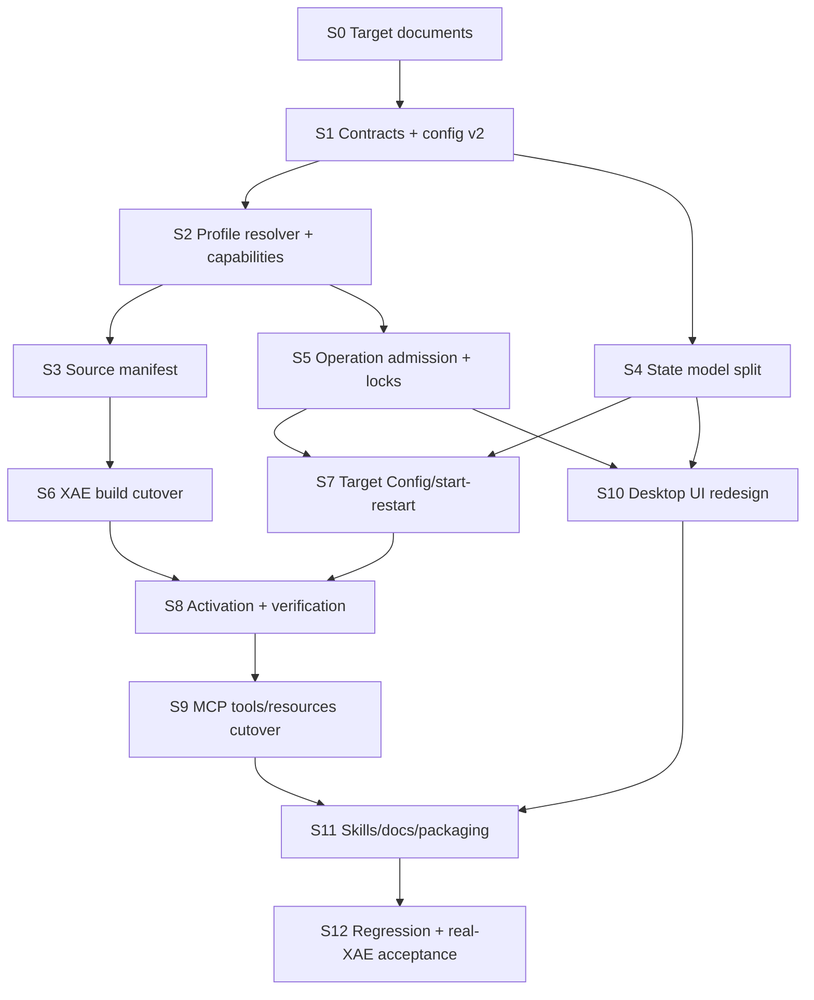

# План полной переработки архитектуры TwinCAT Agent Gateway

> **Статус:** утверждённый план реализации target architecture v2.
> Документ создан 2026-07-31. Ведение рабочего build на каждом промежуточном
> commit не является обязательным; точный broken state и следующий шаг всегда
> должны быть записаны.

- Целевая архитектура: [`ARCHITECTURE.md`](ARCHITECTURE.md).
- Решения и rationale:
  [`ARCHITECTURE_DECISIONS.md`](ARCHITECTURE_DECISIONS.md).
- Target configuration: [`CONFIGURATION.md`](CONFIGURATION.md).
- Target MCP surface: [`MCP_REFERENCE.md`](MCP_REFERENCE.md).
- Agent workflows: [`WORKFLOWS.md`](WORKFLOWS.md).

## 1. Цель переработки

Выполнить несовместимый переход от MVP v1 к архитектуре, где:

- profile является границей ресурсов и maximum capabilities;
- agent передаёт profile, а Gateway проверяет фактические identities;
- Gateway, XAE, Target System и PLC runtimes имеют отдельные states и
  diagnostics;
- Config является обычной Target operation;
- start/restart имеет явную non-idempotent semantics;
- PLC build является compile-oriented operation;
- activation не требует standalone/recent build;
- TcUnit является verification stage activation или Target restart;
- operator session locks уменьшают capabilities online;
- close XAE учитывает process ownership и PID-scoped consent;
- source manifest сообщает агенту связанные с solution source paths;
- MCP tools/resources упорядочены по объектам;
- operation artifacts адресуются exact `operationId`;
- skills и project instructions используют новый workflow.

## 2. Что не требуется во время миграции

- поддерживать API/config compatibility v1;
- сохранять старые tool/resource aliases;
- держать build зелёным после каждого breaking contract commit;
- реализовывать project variant selection;
- реализовывать debugging, symbol writes, forcing или PLC application control;
- сохранять CLI как acceptance surface.

Нерабочий промежуточный state допустим только когда handoff содержит:

- последний commit/HEAD;
- точный список ожидаемых compile/test failures;
- какие контракты уже переключены;
- какие consumers ещё используют v1;
- следующую узкую сессию;
- какие проверки не запускались.

## 3. Организация нескольких агентских сессий

Каждая сессия:

1. начинает с чтения:
   - `AGENTS.md`;
   - этого плана;
   - relevant target document;
   - предыдущего `.session/SESSION_HANDOFF.md`, если он существует;
2. проверяет branch/HEAD/worktree и сохраняет unrelated changes;
3. берёт только один session scope из этого плана;
4. делает один или несколько тематических commits;
5. обновляет progress table и handoff;
6. не выполняет remote activation/TcUnit как inner-loop check;
7. запускает только соответствующий validation checkpoint;
8. честно фиксирует red build, skipped real-XAE checks и remaining consumers.

Рекомендуемый handoff:

```text
Session:
HEAD:
Completed:
Changed contracts:
Expected broken state:
Checks run:
Checks not run:
Next session:
Real-XAE/Gateway/XAE state:
```

## 4. Группировка работ



## 5. Progress

| Session | Scope | Status |
|---|---|---|
| S0 | Target documents, decisions, plan, instructions | completed by this documentation change |
| S1 | Contracts, errors, config schema v2 | completed 2026-07-31 |
| S2 | Profile resolver and effective capabilities | completed 2026-07-31 |
| S3 | Source discovery manifest | completed 2026-07-31 |
| S4 | Separate XAE/System Service/PLC states | completed 2026-07-31 |
| S5 | Operator locks and XAE close consent backend | completed 2026-07-31 |
| S6 | XAE build scope and policy cutover | completed 2026-07-31 |
| S7 | Target Config/start-restart | pending |
| S8 | Activation and TcUnit verification unification | pending |
| S9 | MCP tools/resources and operation journal cutover | pending |
| S10 | Desktop UI redesign | pending |
| S11 | Skills, project template, installed docs, packaging | pending |
| S12 | Full regression and real-XAE acceptance | pending |

## 6. S0 — target documents and migration boundary

### Goal

Make the approved architecture unambiguous before changing code.

### Deliverables

- target `ARCHITECTURE.md`;
- v1 architecture/config baselines preserved;
- target `CONFIGURATION.md`;
- `MCP_REFERENCE.md`;
- `WORKFLOWS.md`;
- `ARCHITECTURE_DECISIONS.md`;
- this implementation plan;
- target-oriented root/project instructions and skills;
- README/document-map updates.

### Validation

- links and renamed files resolve;
- no target document presents v1 commands as target API;
- JSON examples parse;
- skill metadata validates;
- focused Git diff reviewed.

### Exit

Implementation agents can determine:

- target DTOs;
- target tools/resources;
- removed behavior;
- deferred scope;
- first code session without re-deciding architecture.

## 7. S1 — contracts, error envelope, and schema v2

### Goal

Create the breaking type system first, accepting temporary compile failures in
v1 consumers.

### Work package

1. Add target contract types:
   - `GatewayStateSnapshot`;
   - `XaeSessionSnapshot`;
   - `XaeTwinCatSystemObservation`;
   - `TargetSystemObservation`;
   - `PlcRuntimeObservation`;
   - raw ADS/device state evidence;
   - `CapabilityState`;
   - `SourceManifest`;
   - operation/stage result envelope.
2. Remove aggregate `TwinCatStatus.Mode` and ambiguous `runtime` names.
3. Add `component`, `stage`, `sideEffectsStarted`, expected/observed identity,
   and resource links to errors/results.
4. Implement configuration schema v2 DTO/validation:
   - `gateway`;
   - `profiles[].xae`;
   - `profiles[].target`;
   - grouped capabilities;
   - no recent-build settings;
   - no variant selection.
5. Reject schema v1 with `CONFIG_VERSION_UNSUPPORTED`.
6. Replace contract serialization tests.

### Suggested commits

1. `contracts: add v2 object and state model`
2. `configuration: replace schema v1 with grouped v2`
3. `contracts: remove aggregate runtime and v1 envelopes`

Red commits are acceptable if the next commit in the same session restores
contract-project compilation or the handoff lists exact consumers.

### Local validation

- Contracts build;
- contract serialization tests;
- configuration validation tests;
- focused search proving removed fields have enumerated remaining consumers.

### Not in scope

- MCP adapter;
- UI;
- real ADS behavior;
- compatibility converter.

### Exit

Contracts/config projects define the only target model. Remaining v1 compile
errors are grouped by consumer for S2–S10.

## 8. S2 — profile resolver and effective capabilities

### Goal

Move resource identity and authorization into one Gateway service.

### Work package

1. Implement `ProfileResolver`:
   - case-insensitive profile selection;
   - normalized exact solution;
   - optional target;
   - AMS NetId validation;
   - configured solution configuration/platform.
2. Implement `CapabilityEvaluator`:
   - configured capability;
   - session consent hook;
   - operator lock hook;
   - effective result and reason.
3. Replace scattered `allow*` checks with typed capability keys.
4. Ensure caller cannot inject solution/NetId/port.
5. Add capability snapshot store for UI/resources.
6. Add stable denial codes:
   - `CAPABILITY_DISABLED`;
   - `OPERATOR_LOCKED`;
   - `XAE_CLOSE_CONSENT_REQUIRED`.

### Suggested commits

1. `core: centralize profile resource resolution`
2. `core: centralize effective capability evaluation`
3. `desktop: route operation preflight through capability service`

### Local validation

- unit tests for configured/session/effective matrix;
- multi-profile resolution tests;
- missing target/build-only profile tests;
- exact solution/AMS mismatch tests.

### Exit

No domain operation directly interprets raw config booleans.

## 9. S3 — source discovery manifest

### Goal

Expose the authoritative source roots/files associated with a profile solution.

### Work package

1. Extract/reuse one project-graph resolver for:
   - synchronization;
   - build;
   - source discovery.
2. Model:
   - minimal roots;
   - project file and role;
   - supported source extensions;
   - generated/unsupported entries;
   - external-to-solution paths;
   - existence;
   - discovery state/freshness;
   - bounded exact file list.
3. Build `SourceManifestStore`.
4. Refresh after:
   - XAE open/attach;
   - successful full project reload;
   - structural graph change.
5. Mark stale on incomplete/unknown graph operations.
6. Add IPC resource reads for compact manifest and files page.

### Suggested commits

1. `core: share authoritative TwinCAT project graph resolver`
2. `core: produce profile source manifest`
3. `ipc: expose source manifest resources`

### Local validation

- solution with sources beside `.sln`;
- linked PLC project outside solution directory;
- multiple non-overlapping roots;
- missing path;
- generated `.tmc`;
- unsupported object type;
- graph change stale/refresh behavior;
- bounded result and pagination.

### Exit

Agent can discover relevant editable paths using only profile name.

## 10. S4 — separate XAE, Target System, and PLC observations

### Goal

Remove aggregate runtime state and preserve observation provenance.

### Work package

1. Split current monitor/store into:
   - XAE-observed system state provider;
   - direct System Service observer at port 10000;
   - per-PLC runtime observer.
2. Preserve raw:
   - ADS state;
   - device state;
   - AMS NetId/port;
   - timestamp;
   - error.
3. Implement device-specific normalized mappings.
4. Remove `AggregateMode`.
5. Stop propagating PLC Exception into System Service state.
6. Add divergence diagnostics between XAE and direct System Service
   observations.
7. Keep observations available while XAE is disconnected when direct ADS is
   still reachable.
8. Emit component-specific events.

### Required spike

On TwinCAT 3.1.4024.17 determine how to obtain XAE-observed system state:

- typed DTE/Automation Interface property if available;
- otherwise stable UI/status observation;
- otherwise return `unavailable`, never copy direct ADS state.

The spike is read-only.

Session result:

- use typed `ITcSysManager.IsTwinCATStarted()` after exact-solution selection;
- normalize `true` to `Run`;
- retain `false` as a fresh raw observation with normalized `Unknown` until
  `Config` can be confirmed on the TwinCAT 3.1.4024.17 bench;
- return `Unavailable` with XAE-specific error evidence when the call fails;
- never substitute direct ADS state for the XAE observation.

### Suggested commits

1. `contracts: model separate state observations`
2. `ads: split System Service and PLC observers`
3. `desktop: remove aggregate runtime mode`
4. `xae: add engineering-observed system state`

### Local validation

- System Run + PLC Run;
- System Run + one PLC Stop;
- System Run + one PLC Exception;
- System Config with PLC reads intentionally unavailable;
- System unreachable while XAE remains attached;
- XAE observation stale/divergent;
- different raw state values per device type.

### Real-XAE checkpoint

One read-only observation run on the configured remote test bench. No
activation/restart.

### Exit

All state resources can be implemented without reconstructing an aggregate.

## 11. S5 — operator locks and XAE close consent backend

### Goal

Implement online capability reduction before exposing new Target actions.

### Work package

1. Add profile-scoped `OperatorLockStore`.
2. Add master and grouped lock keys.
3. Keep read-only resources available under locks.
4. Check locks:
   - queue admission;
   - before first side effect;
   - at declared safe stage boundaries.
5. Add separate operation cancellation command/service for UI; do not equate
   it with lock.
6. Add `XaeProcessOwnership` and PID-scoped close consent:
   - Gateway-launched default true;
   - attached default false;
   - lost ownership/re-attach default false;
   - reset on PID replacement.
7. Route close/shutdown cleanup through effective capability.

### Suggested commits

1. `core: add profile-scoped operator lock store`
2. `xae: track process ownership and close consent`
3. `operations: enforce locks at admission and safe boundaries`

### Local validation

- static false cannot be elevated;
- lock toggled before queue;
- lock toggled before side effect;
- lock toggled after irreversible stage;
- read-only state remains available;
- close consent resets with PID;
- Gateway shutdown does not close attached XAE without consent;
- no `Process.Kill`.

### Exit

Backend supports UI locks and all later tools can use one capability boundary.

## 12. S6 — XAE build cutover

### Goal

Make Build a compile-oriented XAE operation independent of Target recovery
policy.

### Work package

1. Rename operation contract to `twincat_xae_build`.
2. Add:
   - `scope=plc|solution`;
   - optional logical project id;
   - default `plc`.
3. Use EnvDTE project build for PLC scope.
4. Preserve Build/Rebuild/Clean events/postconditions/diagnostics.
5. Remove:
   - runtime Exception preflight;
   - `BUILD_BLOCKED_BY_RUNTIME_EXCEPTION`;
   - recent-build evidence generation as activation precondition.
6. Preserve synchronization/file-change guard/noise classifier.
7. Ensure build result omits Target state unless a diagnostic stage touched it.

### Required real-XAE cases

- valid PLC Build;
- PLC compile error;
- Rebuild;
- solution scope;
- selected PLC project by logical id;
- Target System Run;
- PLC runtime Exception while PLC project compile is attempted;
- dirty XAE document;
- external source reload;
- `.tsproj` noise.

### Suggested commits

1. `build: add PLC project scope`
2. `build: remove target recovery preflight`
3. `build: cut contracts over to xae namespace`

### Exit

Compile-fix loop requires no status, Config, or Target diagnostic call.

### Completion note (2026-07-31)

- added `XaeBuildScope`, `XaeBuildParameters`, `XaeBuildResult`, and
  `OperationKind.XaeBuild` with PLC scope as the serialization default;
- resolves a logical PLC id from the authoritative project graph immediately
  before the XAE build side effect; one PLC is automatic, multiple or
  duplicate PLC ids are ambiguous, and callers never supply a path;
- PLC Build uses `SolutionBuild.BuildProject`; PLC Clean/Rebuild use the
  project-specific VSSDK build manager with the exact hierarchy and active
  configuration; solution scope retains the solution pipeline;
- preserved synchronization, dirty-document/reload guards, BuildEvents,
  diagnostics, cancellation, and project-noise classification;
- removed Target/runtime Exception reads and recent-build policy from the
  standalone build path while retaining S5 admission and live lock guards;
- cut internal IPC/client dispatch over to `xaeBuild`; public MCP tool wiring
  remains deferred to S9 and Desktop UI redesign remains deferred to S10.

## 13. S7 — Target Config and start/restart

### Goal

Replace recovery policy with explicit Target operations and postconditions.

### Work package

1. Implement `TargetOperationService`.
2. Implement `twincat_target_config`:
   - any source state;
   - confirmed Config no-op;
   - best-effort pre-transition evidence;
   - fresh direct System Service postcondition.
3. Implement `twincat_target_start_restart`:
   - Config/Stopped → start;
   - Run → restart;
   - fresh direct Run postcondition.
4. Use profile/capability/lock services.
5. Keep target semantics separate from PLC application states.
6. Remove:
   - recovery operation kind;
   - `RUNTIME_RECOVERY_REQUIRED`;
   - `twincat_recover_to_config`.

### Suggested commits

1. `target: implement standard Config transition`
2. `target: implement explicit start-restart semantics`
3. `target: remove recovery-specific contracts and service`

### Local validation

- Config from Run/Stop/Exception/Unknown;
- Config no-op;
- start from Config;
- restart from Run;
- static capability denial;
- operator lock;
- target mismatch;
- missing postcondition;
- timeout;
- evidence captured before Config without making it a gate.

### Real-XAE checkpoint

One bounded sequence on the allow-listed remote test bench:

```text
observe -> Config -> observe -> start -> observe -> restart -> observe
```

No activation or test run in this checkpoint.

### Exit

No public/internal policy refers to recovery as a separate user action.

## 14. S8 — activation and TcUnit verification unification

### Goal

Make native activation self-contained and attach TcUnit to activation or
restart.

### Work package

1. Remove recent-build validation and configuration.
2. Keep one native XAE activation command and observe its internal compilation.
3. Return structured stages:
   - sync;
   - compile;
   - deploy;
   - target transition;
   - verification.
4. Add `verification=none|tcunit`.
5. Attach TcUnit to root operation rather than require normal
   `get_test_results`.
6. Allow `twincat_target_start_restart(...tcunit)` for test-only rerun.
7. Strengthen fresh-run proof:
   - report baseline;
   - completion baseline/edge or equivalent run identity;
   - fresh stable XML;
   - suite count.
8. Preserve exact failure stage even when overall workflow fails.

### Suggested commits

1. `activation: remove standalone recent-build precondition`
2. `operations: model activation stage outcomes`
3. `tcunit: attach verification to activation and restart`
4. `tcunit: remove normal get-results workflow`

### Local validation

- activation compile failure;
- deployment failure;
- Run postcondition failure;
- activation success without verification;
- activation success + tests pass;
- activation success + tests fail;
- activation success + completion timeout;
- restart-only tests pass/fail;
- stale completion/report rejected;
- zero tests policy.

### Real-XAE checkpoint

After local stabilization, one combined remote checkpoint:

```text
activation with tcunit -> fresh result
target restart with tcunit -> fresh second result
```

### Exit

Skills can express code+tests in one mutating tool call after edits.

## 15. S9 — MCP tools/resources and journal cutover

### Goal

Expose only target object-oriented surface and operation-specific artifacts.

### Work package

1. Implement tools from `MCP_REFERENCE.md`.
2. Implement resources:
   - Gateway;
   - profile capabilities/sources;
   - XAE;
   - Target;
   - PLC;
   - operation summary/events/artifacts;
   - docs/log.
3. Return structured content, schemas, and resource links.
4. Filter diagnostics by component/profile/operation.
5. Remove global aggregate status/diagnostic/test-result tools.
6. Remove relative `last`/`-N` operation identities.
7. Generate `twincat-doc://mcp` from source metadata.
8. Delete v1 tool/resource tests rather than preserve aliases.

### Suggested commits

1. `mcp: add v2 object-oriented tools`
2. `mcp: add state source and operation resources`
3. `mcp: remove v1 tools and resource aliases`
4. `docs: generate MCP reference from schemas`

### Local validation

- tool/resource listing exact match;
- every mutating result has operation id;
- resource URI validation/path traversal rejection;
- missing artifact does not fall back;
- compact result bounds;
- schema/serialization tests;
- stdio stdout remains protocol-only.

### Exit

MCP adapter contains no v1 public names.

## 16. S10 — Desktop UI redesign

### Goal

Expose the new object/state/capability model without overloading the main
window.

### Work package

1. Build Overview cards:
   - Gateway;
   - XAE;
   - XAE system observation;
   - Target System Service;
   - PLC runtimes;
   - current operation.
2. Follow runtime state colors:
   - green Run;
   - blue Config;
   - red Stop/Exception/fault with distinct labels/icons;
   - gray unknown.
3. Add compact operator-lock panel:
   - master mutating lock;
   - grouped toggles;
   - effective reason.
4. Add PID-scoped XAE close-consent control.
5. Add separate read-only configuration-details view:
   - every option;
   - disabled/read-only checkboxes for Boolean configuration values;
   - explicit/default origin;
   - description;
   - configured/locked/effective values.
6. Add source-manifest view/link.
7. Keep operation execution in shared application services.
8. Add accessible text/icons/tooltips; color is never the only signal.

### Design checkpoint

Before code, save a small wireframe/state matrix in the session handoff or
focused UI design document. Do not add every option as a checkbox to Overview.

### Suggested commits

1. `desktop: separate Overview object state cards`
2. `desktop: add compact operator lock controls`
3. `desktop: add read-only configuration details`
4. `desktop: show source manifest and XAE close consent`

### Validation

- view-model unit tests;
- configured/locked/effective matrix;
- multiple PLC runtimes;
- unknown/divergent observations;
- keyboard/accessibility labels;
- installed/published artifact visual check in interactive Windows session.

### Exit

Operator can understand object state and temporarily block actions without
searching configuration files.

## 17. S11 — skills, project instructions, docs, and packaging

### Goal

Make installed agent behavior and documentation match the implemented v2
surface.

### Work package

1. Finalize:
   - `twincat-build`;
   - `twincat-test`;
   - `twincat-operate`;
   - `twincat-diagnose`.
2. Keep `twincat-debug` absent until implementation exists.
3. Remove `twincat-activate`.
4. Update example project `AGENTS.md`.
5. Update installer/package skill lists and docs.
6. Install generated:
   - configuration reference;
   - MCP reference;
   - setup docs.
7. Update troubleshooting to object-specific diagnostic routing.
8. Remove v1 baseline docs from installed user-facing package while retaining
   them in repository history/baseline files.

### Forward tests

Use fresh agent sessions after tools exist:

- code-only source discovery/edit;
- compile-error repair;
- code+build;
- code+activation;
- code+tests;
- test-only restart;
- operator lock denial;
- XAE mismatch;
- Target unreachable;
- attached XAE close consent.

Forward tests must receive the skill and user-like request, not the expected
answer.

### Exit

No installed skill/instruction names a removed v1 tool.

## 18. S12 — regression, real-XAE acceptance, and release gate

### Goal

Restore a fully working project and verify the target architecture on
TwinCAT 3.1.4024.17.

### Local checkpoints

1. restore/build complete solution;
2. unit tests;
3. contract tests;
4. MCP adapter tests;
5. desktop/view-model tests;
6. packaging/install tests;
7. source/config/MCP documentation generation diff is clean.

### Real-XAE matrix

- Gateway launch/attach;
- exact solution selection;
- source manifest including external roots;
- XAE/source synchronization;
- PLC build success/failure;
- solution build;
- distinct XAE/System Service/PLC state observations;
- operator lock denials;
- attached/Gateway-owned close consent;
- Config from Run and Exception;
- start and Run→Run restart;
- activation internal compile success/failure;
- activation without tests;
- activation with fresh passing/failing TcUnit;
- restart-only fresh TcUnit;
- unknown/modal/timeout evidence.

Before and after state-changing fixture work, run the exact external XAE session
probe documented in `DEVELOPMENT.md`.

### Release gate

- all target docs match code and generated schemas;
- schema v1 and MCP v1 are absent from public package;
- all local required checks pass;
- real-XAE results include exact environment and skipped cases;
- UI is visually checked from the installed artifact;
- no deferred debug/variant capability leaked into supported API.

## 19. Cross-cutting test requirements

Every behavioral session adds:

- success path;
- relevant failure path;
- timeout/cancellation when operation waits;
- capability disabled;
- operator locked;
- profile/identity mismatch;
- no accidental alternate target/path;
- structured component/stage/resource evidence.

Test execution remains checkpoint-based:

- nearest unit tests during inner loop;
- contract tests after DTO/IPC/MCP changes;
- one coherent real-XAE checkpoint after related changes stabilize;
- final combined real-XAE run at S12.

## 20. Explicitly deferred backlog

### Project variant automation

Not part of schema v2 phase 1 or MCP tools. User prepares the solution variant
manually. Gateway observes active variant.

Return when:

- normal/test switching inside one session is required;
- reload/dirty-state semantics are designed;
- exact 4024.17 Automation Interface behavior is tested.

### Debugging and online PLC control

Use cases and non-contract API candidates are retained in
[`WORKFLOWS.md`](WORKFLOWS.md#3-отложенные-сценарии-отладки).

Deferred primitives:

```text
PLC state control
symbol read/watch/write
force/release force
login/logout
online change/download
breakpoints
continue/step
call stack/current location
core-dump fetch/load
```

Before API design, perform a dedicated 4024.17 spike on DTE command identities,
structured debugger state, dialogs, and postconditions.

### Multi-PLC TcUnit aggregation

Phase 1 retains one configured TcUnit publisher/report per profile. State
monitoring may expose multiple PLC runtimes, but verification aggregation is
deferred.

### Other deferred work

- HTTP/gRPC transport;
- repository CLI acceptance;
- TwinCAT 4026/Visual Studio 2022 support;
- local runtime control profiles;
- arbitrary caller-selected ADS ports/NetIds;
- compatibility aliases.

## 21. Definition of Done

Architecture rework is complete when:

- code implements target architecture/config/MCP reference;
- aggregate runtime state and recovery policy are removed;
- source manifest works for external project roots;
- profile/capability/lock/ownership rules are enforced centrally;
- build/activation/test workflows match the target sequences;
- UI separates Overview, locks, and full read-only options;
- skills and project template use only v2 tools/resources;
- package contains generated current docs;
- local and required real-XAE validation pass;
- all deferred capabilities remain explicitly unsupported;
- `ARCHITECTURE_REWORK_PLAN.md` progress is fully completed and final handoff
  contains no required remaining work.
